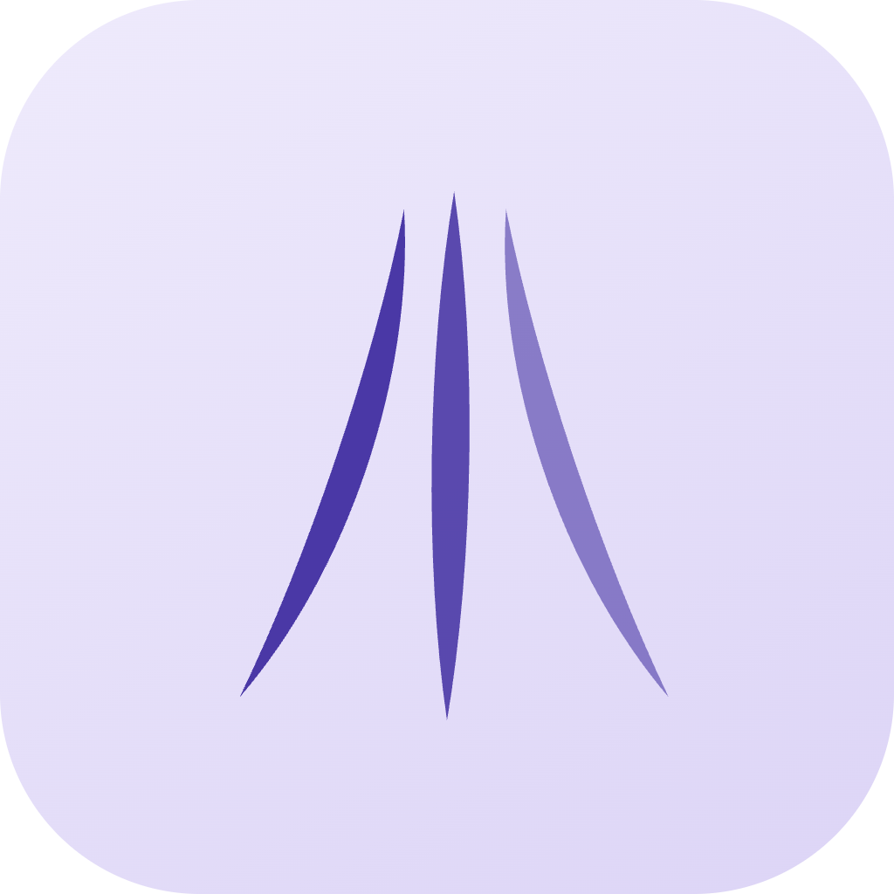

  

<h1 align="center">Splay</h1>

  A one-gesture voice recorder for Mac. Tap <kbd>fn</kbd>, talk, get a transcript file.
  Fully on-device.

  
  
  

---

Splay records a conversation and hands you a text file. That is the whole product.

No account, no cloud, no window to manage. Speech recognition runs on the Neural Engine
of your own Mac — audio never leaves the machine.

## How it works

One key, two gestures:

| Gesture | Records | Result |
|---|---|---|
| **Tap `fn`** | Microphone only | Transcript file |
| **Double-tap `fn`** | Microphone **+** system audio | Transcript file |
| **Drop a file on the menu bar icon** | Any audio or video file | Transcript file |

Tap again to stop. The transcript is written to disk; the audio is kept beside it.

## Two surfaces, no third

**The island** — a flat-black pill that hangs from the notch. It is an *indicator*, not a
control panel. While you record, five small red bars follow your voice and a timer counts
up, so you can see it is hearing you; an amber spinner means transcribing, a green check
means the file is written. If your microphone is dead rather than merely silent, the bars
go flat and amber so you find out in the first second instead of at the end.

**The card** — one centred panel carrying everything else: recent recordings, settings,
about. Click the mark on the island to open it. Esc or click away to dismiss.

There is no main window, no sidebar, no menu to learn.

## Transcripts are verbatim

A transcript is never polished. Splay writes what was said, including the parts that came
out badly. If you want something tightened up, that is a separate, deliberate step on a
*summary* — never an edit to the record. Preserving doubt is the point: when you are
reading back a conversation, the uncertainty is signal.

## Speed

Transcription runs locally on the Apple Neural Engine via
NVIDIA's **Parakeet TDT 0.6B-v3**, run as CoreML through
[FluidAudio](https://github.com/FluidInference/FluidAudio):

- **~155× realtime** — an hour of audio in roughly 23 seconds
- **~2.5% word error rate**
- **~66 MB** working memory per active inference slot
- 25 European languages, auto-detected

## Requirements

- Apple Silicon Mac (M1 or later)
- macOS 14.2 or later
- ~465 MB for the speech model, downloaded on first use

## Install

Download the latest `.dmg` from [Releases](https://github.com/etopianreglazer/splay/releases),
drag Splay to Applications, and launch it.

On first launch Splay asks for **Microphone** access. It asks for **Screen & System Audio
Recording** only the first time you triple-tap `fn` — if you only ever record yourself, it
never asks.

## Status

Splay is built for one person's workflow and shared in case it suits yours. It works, and
it is what I use every day. Things you should know before installing:

- **There is no onboarding yet.** A fresh install drops you straight at the island with no
  guided setup. This README is the setup.
- Sparkle auto-update is wired but the update feed goes live with the first release.

## Privacy

- Speech recognition is **on-device**. No audio, and no transcript, is uploaded.
- No account, no login.
- **Telemetry is off** unless you turn it on. There is no persistent identifier and
  content is never included.
- Recordings and transcripts are ordinary files in a folder you choose
  (default `~/Documents/MacParakeet-MC/`).
- Network access happens only for the one-time speech-model download and update checks.
  Splay has no AI features and no cloud integrations — analyze your transcripts with
  whatever tool you like; Splay never parses them twice.

## Built on MacParakeet

Splay began as a fork of **[MacParakeet](https://github.com/moona3k/macparakeet)** by
**Daniel Moon**, and keeps its speech engine, capture pipeline, and data layer. It has since
diverged substantially: a different interaction model (one `fn` gesture instead of separate
dictation and meeting modes), a different interface (two ambient surfaces instead of a
windowed app), a different visual identity, and a different product goal — recording a
conversation to a file, rather than dictating text into other apps.

MacParakeet is excellent, broader software. If you want dictation-into-any-app, file and
YouTube transcription, meeting summaries, calendar auto-start, or LLM text transforms,
**use MacParakeet** — it does all of that and Splay deliberately does not.

Splay is licensed **GPL-3.0**, the same as the work it derives from. Copyright on the
original work remains with Daniel Moon; see [LICENSE](LICENSE) and
[THIRD_PARTY_LICENSES.md](THIRD_PARTY_LICENSES.md).

## License

[GPL-3.0](LICENSE). Free software.
